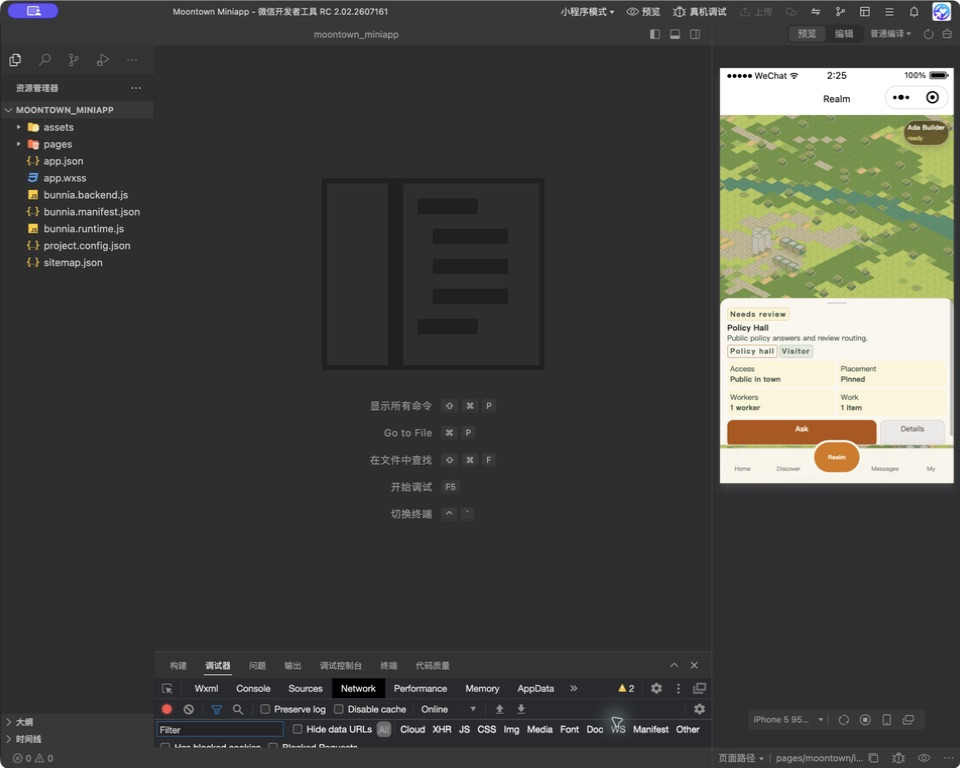
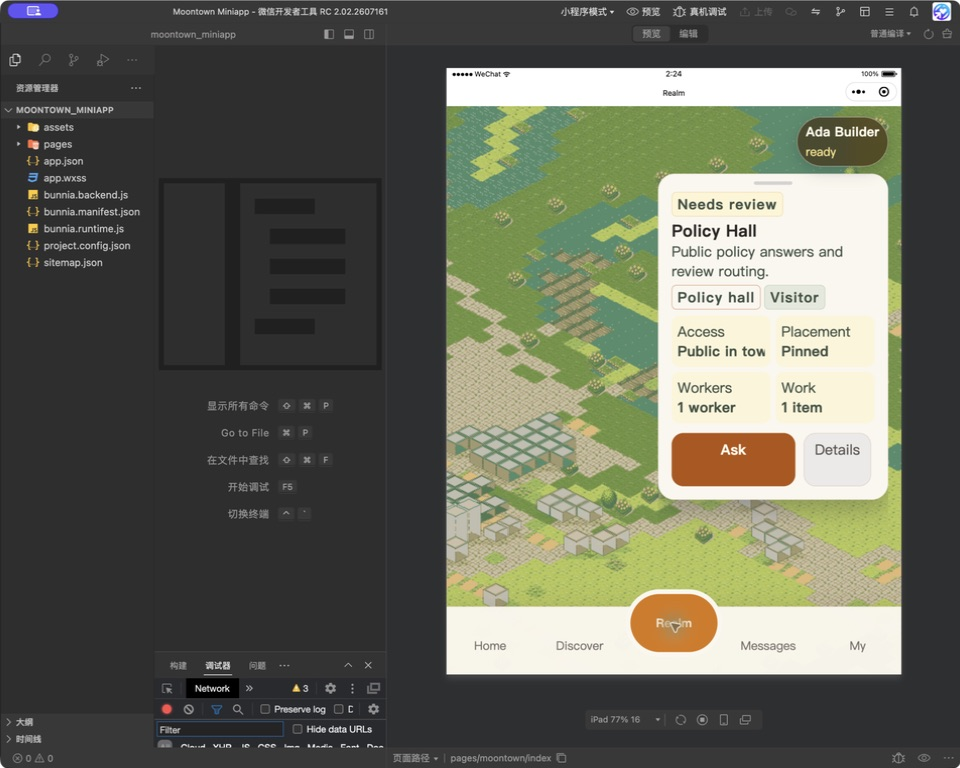
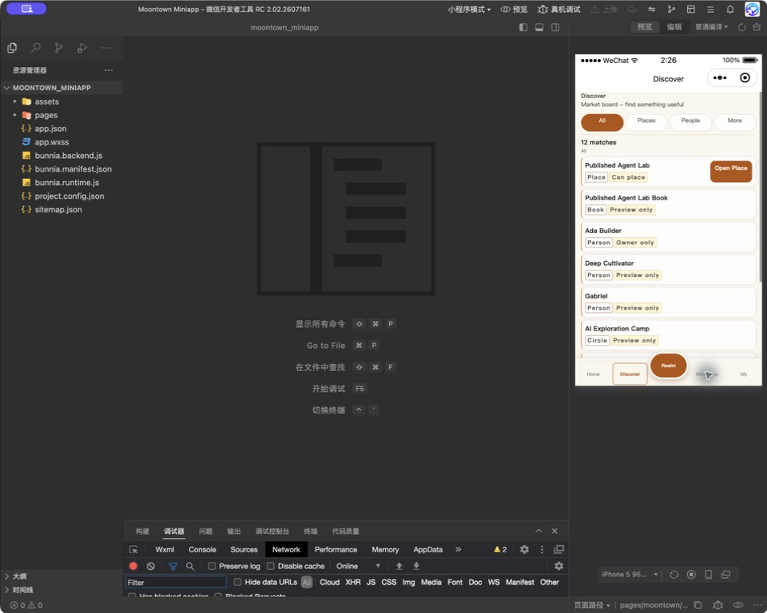
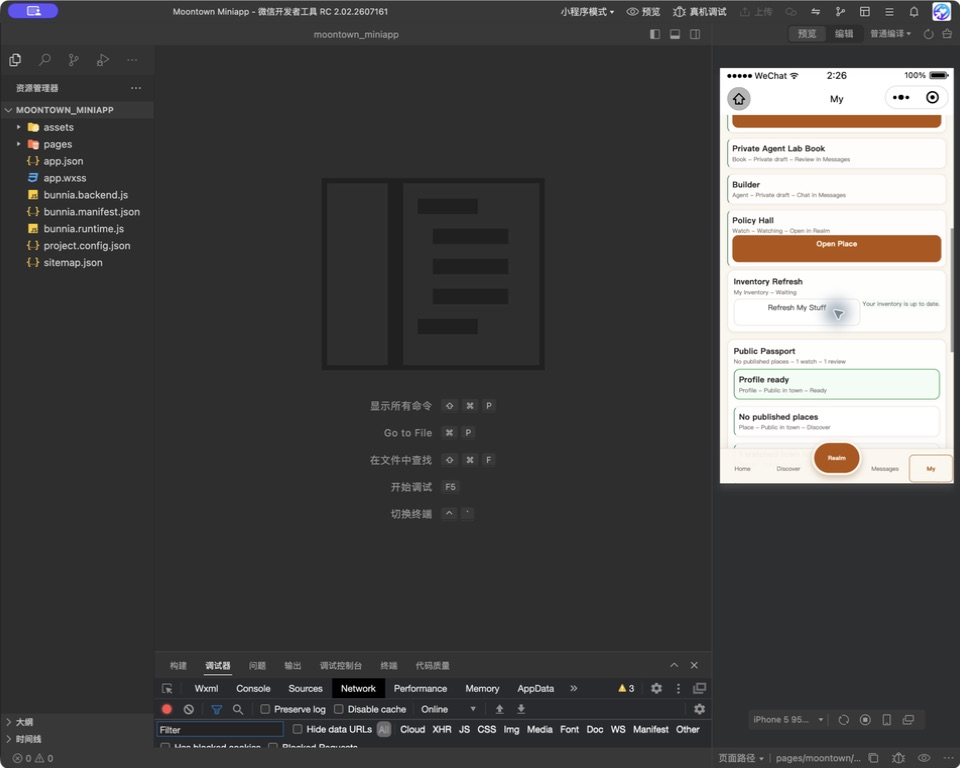
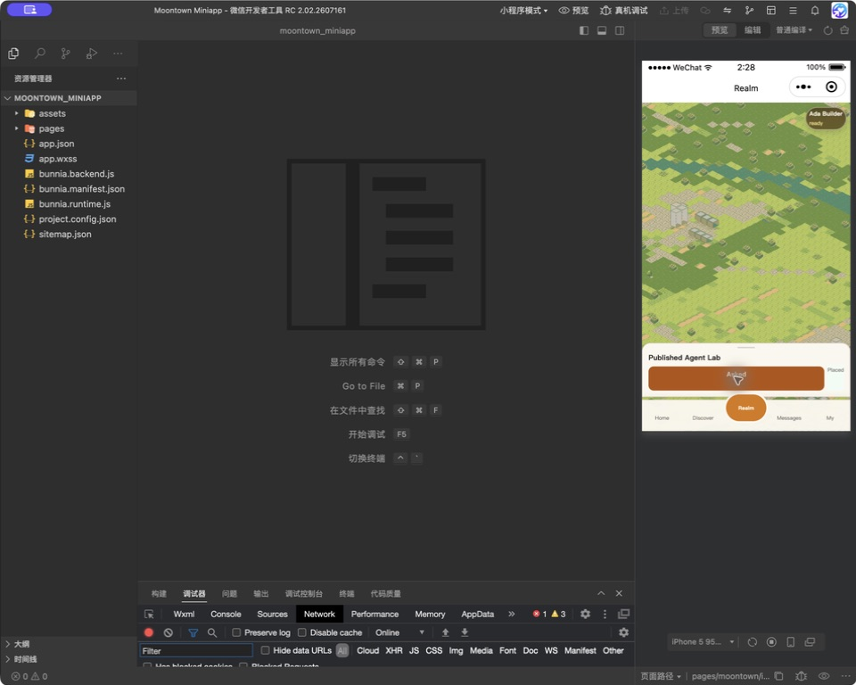
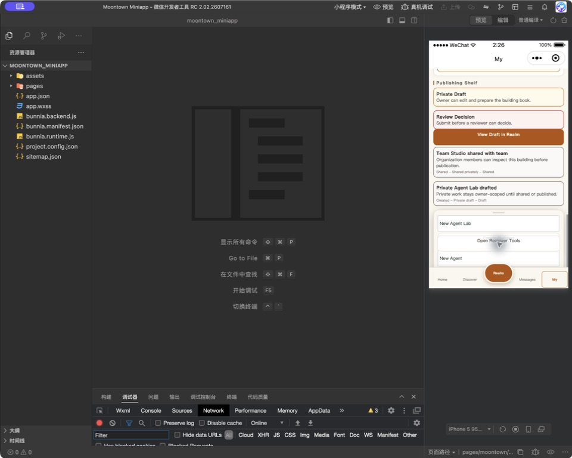

# Moontown V6 UI Release Test Report

Date: 2026-07-24
Target: generated WeChat mini-app
Architecture: MoonBit application code, Bunnia-generated WeChat project
Reference: `LEPUSA_APP_RELEASE_HANDOVER.md` product/UI definition of done

## Verdict

**PASS — local product UI release gate.**

The updated Kimi reference was treated as a visual and interaction source, not
merged as a second implementation. Moontown keeps its MoonBit/Bunnia
architecture, adopts the clearer hierarchy and compact mobile behavior, and
removes reference-only or dead controls.

This verdict covers the generated mini-app, local backend, actual WeChat
DevTools journeys, responsive layouts, feedback states, and automated release
checks. It does not claim AppID authorization, store submission, signing, or
production backend deployment.

## Release gates

| Gate | Result | Evidence |
| --- | --- | --- |
| MoonBit interfaces and formatting | Pass | `moon info`, `moon fmt` |
| MoonBit suite | Pass | 238/238 tests |
| Local backend smoke | Pass | `moontown-miniapp-backend smoke ok` |
| Strict WeChat build | Pass | Release readiness `ready`, 8/8 checks |
| Generated diagnostics | Pass | 0 diagnostics |
| WXML budget | Pass | 92,162 bytes |
| WXSS budget | Pass | 35,642 bytes |
| JS budget | Pass | 58,583 bytes |
| First-screen budget | Pass | 75,799 / 76,000 bytes |
| Largest update payload | Pass | 2,878 / 4,096 bytes |
| Largest update operation count | Pass | 42 / 64 |
| Phone and tablet UI | Pass | 320×568, standard phone, 768×1024 |
| Console and network | Pass | Empty console; Ask request returned 200 |
| Offline failure and retry | Pass | Failure visible; same action recovered after backend restart |

## Human journeys

### 1. First visit to a usable town

1. Clear DevTools data and compile.
2. Tap **Enter Town**.
3. Confirm Ada Builder becomes ready and no failure remains.

Observed: the first-visit state completed in place, then exposed the normal
five-tab town with exactly one active navigation item.

### 2. Discover a place, ask it to work, and place it

1. Open **Discover**.
2. Use **Placeable**.
3. Open Published Agent Lab.
4. Confirm Realm opens the same building rather than the default selection.
5. Tap **Ask**.
6. Tap **Place**.

Observed: the routed building identity was preserved. Ask targeted Published
Agent Lab and ended as **Asked**. Place ended as **Placed** and the Place
control disappeared, preventing a duplicate submission from the drawer.

### 3. Triage and complete work

1. Open **Messages**.
2. Exercise All, Unread, Activity, Replies, and Notices.
3. Refresh chats.
4. Approve a pending memory review.
5. Stop Market placement scan.

Observed: filters changed both the visible rows and counts. Refresh reported
**Chats are up to date**. Approval removed the review and its matching answer.
Stop Work reported **Work stopped**, removed only Market placement scan, and
left Private lab setup running.

### 4. Manage personal work without hunting

1. Open **My**.
2. Exercise All, Placed, Drafts, Published, Books, Agents, and Watches.
3. Refresh My Stuff.
4. Create a building and an agent.
5. Open the Town Guide.

Observed: each inventory filter showed the expected subset. Refresh resolved
the stale alert and changed the attention state to **All Clear**. Creation
actions reported **Building created** and **Agent created**. The guide offers
direct starts into Discover and agent-work review.

### 5. Reviewer operations

1. Open **My → Open Reviewer Tools**.
2. Run **Check Town Safety** and **Launch Checks**.
3. Use eligible **Hide** and **Takedown** moderation actions.
4. Return to My.

Observed: each operation produced a plain-language success message. The
fixture-ineligible Appeal action was removed instead of displaying a control
that the backend would reject.

### 6. Failure and recovery

1. Stop the backend.
2. Tap Ask.
3. Restart the backend with the same state.
4. Retry Ask.

Observed: the app showed a visible failure while offline. The retry completed
as **Asked** and cleared the failure without requiring navigation away.

## Control and state coverage

| Surface | Controls and states exercised | Result |
| --- | --- | --- |
| Global navigation | Home, Discover, Realm, Messages, My; active state | Pass |
| Home | Priority lead and Browse/Review/Verify routes | Pass |
| Discover | All, Places, People, Circles, Products, Demands, Events, Posts, Agents, Books, Placeable | Pass |
| Realm map | Selection, pan/zoom, marker/drawer identity | Pass |
| Realm drawer | Details, Ask loading/success/failure/retry, Place success, Messages, Find Similar | Pass |
| Messages | All, Unread, Activity, Replies, Notices, row open, refresh, approve, Stop Work | Pass |
| My inventory | All, Placed, Drafts, Published empty state, Books, Agents, Watches | Pass |
| My actions | Refresh, Create Building, Create Agent, Reviewer entry, Guide routes | Pass |
| Reviewer | Safety check, launch checks, Hide, Takedown, Back to My | Pass |
| Responsive | Phone, 320×568 narrow phone, 768×1024 tablet | Pass |
| Runtime states | First visit, ready, empty, loading, success, error, retry, completed/removed | Pass |

## Defects found and fixed during the journeys

| Defect | Resolution |
| --- | --- |
| Discover exposed controls without a complete destination | Removed dead primary actions; preview-only cards now say so |
| Category controls were rendered as inert text | Converted filters to accessible actions with truthful counts |
| Opening a place lost its identity and returned to the default Realm selection | Carried building identity through routes and hydrated the Realm selection |
| Routed compact drawer used generic content and wrong Ask target | Added a selected-building drawer and bound Ask/Place to that building |
| Place had no conclusive state and could appear repeatable | Added Placed feedback and removed the action after success |
| Backend actions had no consistent visible feedback | Added reusable loading, success, and failure feedback |
| Stop Work failed because the UI fixture and backend seed disagreed | Aligned seeded running jobs and hid only the completed row |
| Review approval left related work visible | Synchronized review and work-result removal |
| My refresh retained a stale alert | Matched the alert identity and resolved to All Clear |
| Reviewer showed an Appeal action the fixture was not allowed to submit | Removed the ineligible action; retained eligible moderation controls |
| Details wrapped at tablet width | Adjusted drawer action layout |
| Generated WXML could contain an unsafe logical expression | Corrected event patch generation and added adapter coverage |
| Ordinary pages leaked implementation-oriented labels | Kept diagnostics language inside Reviewer Tools |

## Visual evidence

### Realm

### Core tabs

### Actions and recovery

## Operational handover

The generated directory is replaced on each build. If it is already open in
WeChat DevTools, close and reopen or re-import it after regeneration. Otherwise
DevTools can retain a removed current directory and fail compilation with
`ENOENT ... uv_cwd`. The repeatable path and acceptance checklist live in
`docs/MOONTOWN_DEVTOOLS_SMOKE.md`.

Use `docs/UI_GUIDE.md` for product language and the in-app **Town Guide** for
first-time user orientation.
